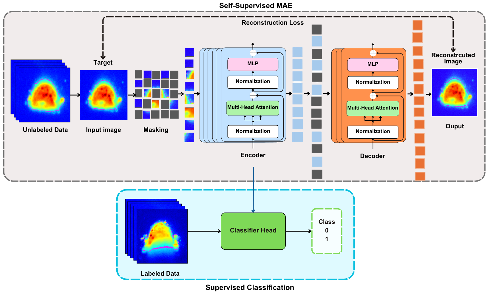

# In-Situ Melt Pool Characterization via Thermal Imaging for Defect Detection in Directed Energy Deposition Using Vision Transformers

This repository contains code for the [In-Situ Melt Pool Characterization via Thermal Imaging for Defect Detection in Directed Energy Deposition Using Vision Transformers](https://doi.org/10.1016/j.jmapro.2025.03.123) — a framework that leverages self-supervised learning on large volumes of unlabeled thermal melt pool data using a state-of-the-art Vision Transformer-based Masked Autoencoder (MAE).

In real-life manufacturing settings, labeling such large datasets accurately is often challenging and expensive, leading to a scarcity of labeled datasets. This framework addresses these challenges by learning from a huge unlabeled thermal dataset of melt pools with limited labels. The pretraining step enables the model to learn highly representative spatial embeddings. Transfer learning is then applied to fine-tune the MAE encoder on a smaller labeled dataset for melt pool anomaly classification.

To evaluate the effectiveness of our approach, we explore two classifier designs:
1. A Vision Transformer (ViT) classifier utilizing the fine-tuned MAE encoder weights
2. The fine-tuned  MAE encoder with an MLP head for downstream classification

## 🧠 Framework Overview



## 📂 Repository Contents

| File                      | Description                                                                 |
|---------------------------|-----------------------------------------------------------------------------|
| `vit_mae_masked.py`       | Self-supervised masked pretraining using MAE on unlabeled thermal images.  |
| `mae_mlp_class_6_fold.py` | Fine-tunes the MAE encoder with a lightweight MLP classifier using 6-fold CV.|
| `vit_class_cross_val.py`  | Fine-tunes the ViT encoder (initialized from MAE weights) with a linear classifier using CV. |

## 🚀 How to Use

### 1. MAE Pretraining (Unlabeled Images)

```bash
python vit_mae_masked.py     --data_dir /path/to/unlabeled/images     --epochs 100     --batch_size 16     --lr 1e-4     --save_path ./mae_model.pth     --loss_plot_path ./loss_curve.png     --recon_save_folder ./reconstructed_images
```

### 2. MAE Encoder with MLP Classifier (Labeled Data)

```bash
python mae_mlp_cross_val.py     --image_dir /path/to/labeled/images     --label_csv /path/to/labels.csv     --mae_weights_path /path/to/mae_model.pth     --output_dir ./mae_mlp_cross_val_outputs     --epochs 100     --batch_size 32     --lr 1e-4     --num_folds 6     --fold_start 1
```

### 3. ViT Classifier Fine-tuning from MAE Weights

```bash
python vit_class_cross_val.py     --image_dir /path/to/images     --label_csv /path/to/labels.csv     --mae_weights_path /path/to/mae_model.pth     --output_dir ./vit_cross_val_outputs     --epochs 100     --batch_size 32     --lr 1e-4     --num_folds 6     --fold_start 1
```

## 📈 Output

For each fold:

- Best model weights: `best_vit_classification_fold_{fold}.pth`
- Loss curves: `loss_curve_fold_{fold}.png`
- Printed metrics: Accuracy, Precision, Recall, F1-Score, and Confusion Matrix.

## 🛠️ Requirements

- Python >= 3.8  
- PyTorch  
- Transformers (HuggingFace)  
- scikit-learn  
- Matplotlib  
- Pillow  

### 🔧 Install via:

```bash
pip install torch torchvision transformers scikit-learn matplotlib pillow timm==0.4.5
```

## 📄 License

Released under the [MIT License](LICENSE).

## 👩‍💻 Author

Maintained by [Israt Zarin Era](https://github.com/IE0005)